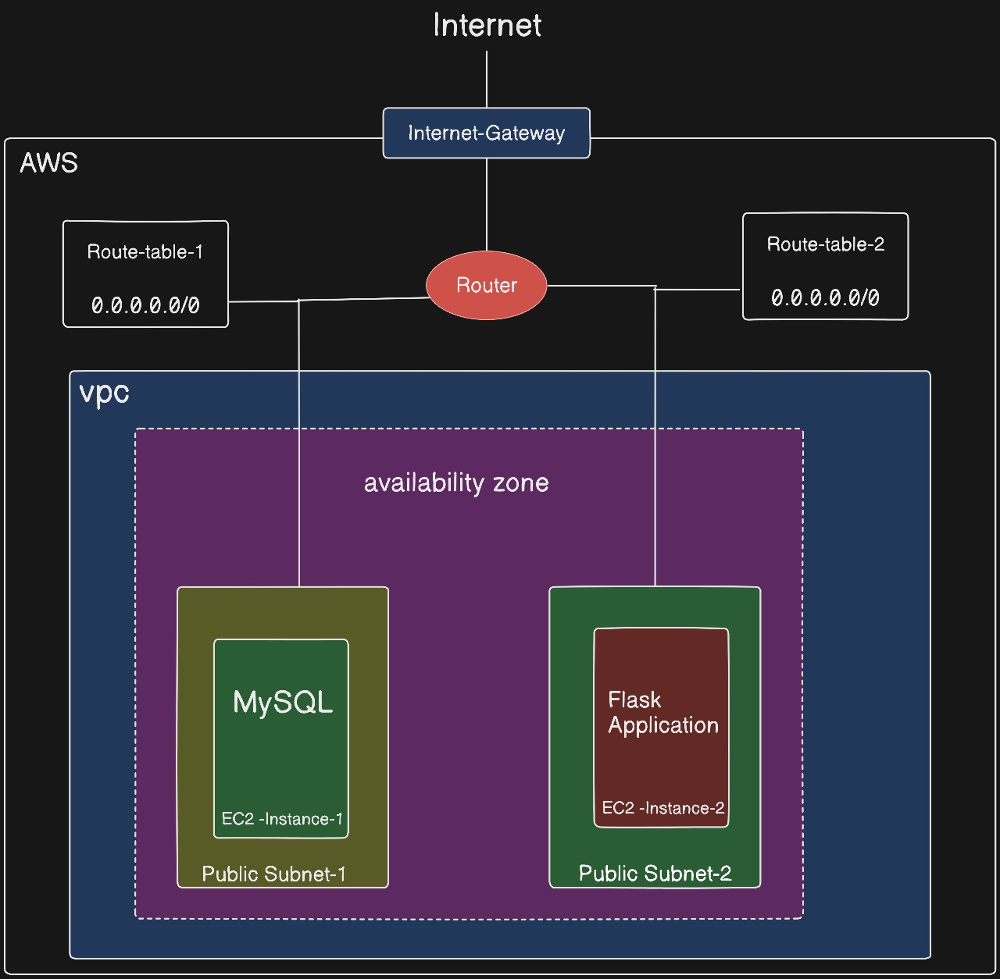

# Launching Mysql and Flask application on EC2 instance from two different public subnet

This documentation outlines the process to set up a VPC with two public subnets, corresponding route tables, and a network gateway. Further we launch the Mysql and Flask application on EC2 instance from two different public subnets.

## Step-by-Step Guide to Create a VPC

### Step 1: Create the VPC

1. **Create a VPC:**
   - In the navigation pane, click on **Your VPCs**.
   - Click **Create VPC**.
   - Provide the following details:
     - **Name tag:** `my-vpc`
     - **IPv4 CIDR block:** `10.0.0.0/16`
     - **Tenancy:** Default
   - Click **Create VPC**.

### Step 2: Create Subnets

1. **Create Public Subnet 1:**
   - In the navigation pane, click on **Subnets**.
   - Click **Create subnet**.
   - Select your VPC from the **VPC ID** dropdown.
   - Provide the following details:
     - **Subnet name:** `public-subnet-1`
     - **Availability Zone:** `us-east-1a`
     - **IPv4 CIDR block:** `10.0.1.0/24`
   - Click **Create subnet**.

2. **Create Public Subnet 2:**
   - Click **Create subnet** again.
   - Select your VPC from the **VPC ID** dropdown.
   - Provide the following details:
     - **Subnet name:** `public-subnet-2`
     - **Availability Zone:** `us-east-1a`
     - **IPv4 CIDR block:** `10.0.2.0/24`
   - Click **Create subnet**.

### Step 3: Create Route Tables

1. **Create Public Route Table 1:**
   - In the navigation pane, click on **Route tables**.
   - Click **Create route table**.
   - Select your VPC from the **VPC ID** dropdown.
   - Provide the following details:
     - **Name tag:** `public-route-table-1`
   - Click **Create route table**.

2. **Create Public Route Table 2:**
   - Click **Create route table** again.
   - Select your VPC from the **VPC ID** dropdown.
   - Provide the following details:
     - **Name tag:** `public-route-table-2`
   - Click **Create route table**.

### Step 4: Create an Internet Gateway

1. **Create the Internet Gateway:**
   - In the navigation pane, click on **Internet Gateways**.
   - Click **Create internet gateway**.
   - Provide the following details:
     - **Name tag:** `my-gateway`
   - Click **Create internet gateway**.

2. **Attach the Internet Gateway to Your VPC:**
   - Select the internet gateway you just created.
   - Click **Actions**, then **Attach to VPC**.
   - Select your VPC from the **VPC ID** dropdown.
   - Click **Attach internet gateway**.

### Step 5: Update Route Tables

1. **Update Public Route Table 1:**
   - Select `public-route-table-1`.
   - Click on the **Routes** tab, then click **Edit routes**.
   - Click **Add route**.
   - Provide the following details:
     - **Destination:** `0.0.0.0/0`
     - **Target:** Select **Internet Gateway** and then select `my-gateway`.
   - Click **Save routes**.

2. **Update Public Route Table 2:**
   - Select `public-route-table-2`.
   - Click on the **Routes** tab, then click **Edit routes**.
   - Click **Add route**.
   - Provide the following details:
     - **Destination:** `0.0.0.0/0`
     - **Target:** Select **Internet Gateway** and then select `my-gateway`.
   - Click **Save routes**.

### Step 6: Associate Subnets with Route Tables

1. **Associate Public Subnet 1 with Public Route Table 1:**
   - Select `public-route-table-1`.
   - Click on the **Subnet associations** tab, then click **Edit subnet associations**.
   - Select `public-subnet-1`.
   - Click **Save associations**.

2. **Associate Public Subnet 2 with Public Route Table 2:**
   - Select `public-route-table-2`.
   - Click on the **Subnet associations** tab, then click **Edit subnet associations**.
   - Select `public-subnet-2`.
   - Click **Save associations**.

### Step 7: Launch an EC2 Instance in Public Subnet 1

1. **Launch an Instance:**
   - Click on **Instances** in the navigation pane.
   - Click **Launch Instances**.
   - Choose an Amazon Machine Image (AMI). Search for "Ubuntu" and select the latest Ubuntu Server LTS AMI.
   - Select an instance type, e.g., `t2.micro`.
   - Click **Next: Configure Instance Details**.

2. **Configure Instance Details:**
   - **Network:** Select `my-vpc`.
   - **Subnet:** Select `public-subnet-1`.
   - **Auto-assign Public IP:** Enable.
   - Click **Next: Add Storage**.

3. **Configure Security Group:**
   - Select **Create a new security group**.
   - Security group name: `public-sg-1`.
   - Add rules to allow SSH (port 22) and HTTP (port 80) access.
     - Type: `SSH`, Protocol: `TCP`, Port Range: `22`, Source: `0.0.0.0/0` (Anywhere) or restrict as needed.
     - Type: `All traffic`, Protocol: `All`, Port Range: `All`, Source: `0.0.0.0/0` (Anywhere).
   - Click **Review and Launch**.

4. **Review and Launch:**
   - Click **Launch**.
   - Select an existing key pair or create a new key pair, then click **Launch Instances**.
   - Click **View Instances** to see the status of your instance.
   - Click "Connect".

### Step 8: Launch an EC2 Instance in Public Subnet 2

1. **Launch an Instance:**
   - Launch another instance like **Step 7** above.

2. **Configure Instance Details:**
   - **Network:** Select `my-vpc`.
   - **Subnet:** Select `public-subnet-2`.
   - **Auto-assign Public IP:** Enable.
   - Click **Next: Add Storage**.

3. **Configure Security Group:**
   - Select **Create a new security group** or use an existing one.
   - Security group name: `public-sg-2`.
   - Add rules to allow SSH (port 22) and HTTP (port 80) access.
     - Type: `SSH`, Protocol: `TCP`, Port Range: `22`, Source: `0.0.0.0/0` (Anywhere) or restrict as needed.
     - Type: `All traffic`, Protocol: `All`, Port Range: `All`, Source: `0.0.0.0/0` (Anywhere).
   - Click **Review and Launch**.

4. **Review and Launch:**
   - Click **Launch**.
   - Select an existing key pair or create a new key pair, then click **Launch Instances**.
   - Click **View Instances** to see the status of your instance.
   - Click "Connect".

## Summary
You have now successfully created a VPC with the following components:
- A VPC named `my-vpc`.
- Two public subnets (`public-subnet-1` and `public-subnet-2`).
- Two public route tables (`public-route-table-1` and `public-route-table-2`).
- An internet gateway named `my-gateway` attached to the VPC.
- Appropriate route configurations and subnet associations for routing internet traffic.
- You have successfully launched two Ubuntu EC2 instances in your VPC:
    - `public-instance-1` in `public-subnet-1` with a public IP address.
    - `public-instance-2` in `public-subnet-2` with a public IP address.
